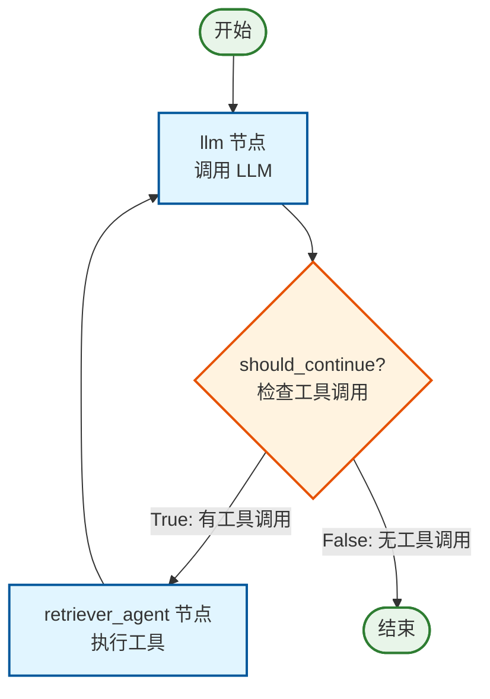

# RAG Agent Graph 流程图

## Graph 结构说明

这个 RAG Agent 使用 LangGraph 构建了一个循环的 Agent 流程，包含以下节点和边：

### 节点 (Nodes)

1. **llm** - LLM 调用节点
   - 接收用户问题和对话历史
   - 添加系统提示词
   - 调用 LLM 生成响应或工具调用

2. **retriever_agent** - 工具执行节点
   - 执行 LLM 返回的工具调用
   - 调用 `retriever_tool` 检索文档
   - 返回检索结果

### 边 (Edges)

1. **条件边 (Conditional Edge)**: `llm` → `should_continue`
   - 检查 LLM 响应是否包含工具调用
   - 如果 `True` (有工具调用) → 转到 `retriever_agent`
   - 如果 `False` (无工具调用) → 转到 `END` (结束)

2. **循环边 (Loop Edge)**: `retriever_agent` → `llm`
   - 工具执行完成后，返回 LLM 节点
   - LLM 基于检索结果生成最终答案

## 流程图

```
┌─────────────────────────────────────────────────────────────────────┐
│                                                                     │
│  ┌─────────────┐                                                    │
│  │   START     │                                                    │
│  └──────┬──────┘                                                    │
│         │                                                           │
│         ▼                                                           │
│  ┌─────────────┐                                                    │
│  │     llm     │◄──────────────────────────────────────┐            │
│  │  (LLM Node) │                                       │            │
│  └──────┬──────┘                                       │            │
│         │                                               │            │
│         ▼                                               │            │
│  ┌─────────────┐                                       │            │
│  │should_continue│                                     │            │
│  │(Condition)  │                                       │            │
│  └──────┬──────┘                                       │            │
│         │                                               │            │
│    ┌────┴────┐                                         │            │
│    │         │                                          │            │
│    ▼         ▼                                          │            │
│  True      False                                        │            │
│    │         │                                          │            │
│    ▼         ▼                                          │            │
│  ┌─────────────┐  ┌─────────┐                          │            │
│  │retriever_   │  │   END   │                          │            │
│  │  agent      │  └─────────┘                          │            │
│  │(Tool Exec)  │                                       │            │
│  └──────┬──────┘                                       │            │
│         │                                               │            │
│         └───────────────────────────────────────────────┘            │
│                                                                     │
└─────────────────────────────────────────────────────────────────────┘
```

## 执行流程

```
用户输入问题
    │
    ▼
┌──────────────────────────────────────────────────────────────┐
│ 1. llm 节点                                                   │
│    - 接收 HumanMessage                                        │
│    - 添加 SystemMessage (系统提示词)                           │
│    - 调用 LLM (gpt-4o)                                        │
│    - LLM 决定: 是否需要调用工具?                               │
└──────────────────────────────────────────────────────────────┘
    │
    ▼
┌──────────────────────────────────────────────────────────────┐
│ 2. should_continue 检查                                       │
│    - 检查 LLM 响应是否包含 tool_calls                          │
│    - 如果有工具调用 → 继续执行工具                             │
│    - 如果没有工具调用 → 结束，返回答案                         │
└──────────────────────────────────────────────────────────────┘
    │
    ├─── 有工具调用 ───► ┌──────────────────────────────────────┐
│                        │ 3. retriever_agent 节点               │
│                        │    - 执行 retriever_tool              │
│                        │    - 查询 ChromaDB 向量数据库          │
│                        │    - 返回检索到的文档内容              │
│                        └──────────────────────────────────────┘
│                                │
│                                ▼
│                        ┌──────────────────────────────────────┐
│                        │ 4. 返回 llm 节点 (循环)                │
│                        │    - LLM 接收 ToolMessage             │
│                        │    - 基于检索结果生成最终答案          │
│                        │    - 或继续调用更多工具                │
│                        └──────────────────────────────────────┘
│                                │
│                                └───────► 回到步骤 2
│
    └─── 无工具调用 ───► ┌──────────────────────────────────────┐
                         │ 5. END                                │
                         │    - 返回最终答案给用户                │
                         └──────────────────────────────────────┘
```

## Mermaid 流程图



## 数据流

```
AgentState:
┌─────────────────────────────────────────┐
│ messages: Annotated[Sequence[BaseMessage], add_messages] │
├─────────────────────────────────────────┤
│                                         │
│ 1. [HumanMessage] - 用户问题             │
│ 2. [SystemMessage] - 系统提示词          │
│ 3. [AIMessage] - LLM 响应 (可能含工具调用)│
│ 4. [ToolMessage] - 工具执行结果          │
│ 5. [AIMessage] - 最终答案                │
│                                         │
└─────────────────────────────────────────┘
```

## 关键代码映射

| 流程步骤 | 代码位置 | 函数 |
|---------|---------|------|
| llm 节点 | `call_llm(state)` | 调用 LLM 并返回响应 |
| 条件检查 | `should_continue(state)` | 检查是否有 tool_calls |
| retriever_agent 节点 | `take_action(state)` | 执行工具调用 |
| 图构建 | `graph.add_node()`, `graph.add_edge()` | 定义节点和边 |
| 编译 | `graph.compile()` | 编译为可执行的 rag_agent |

